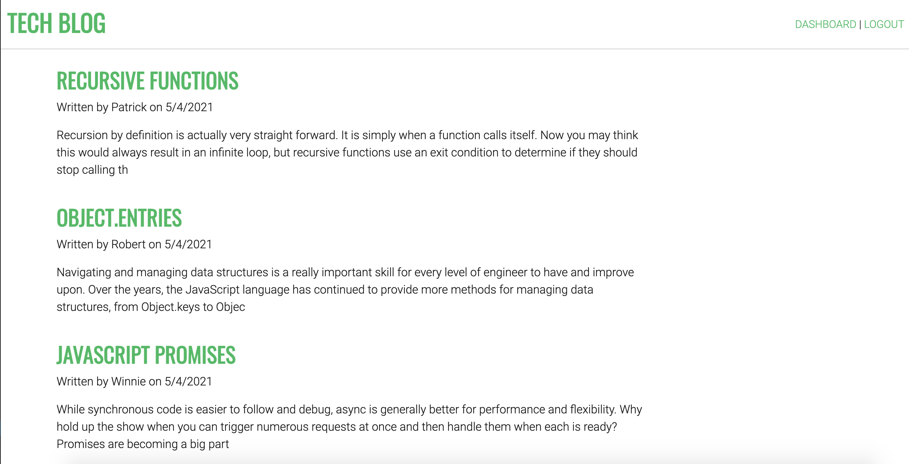
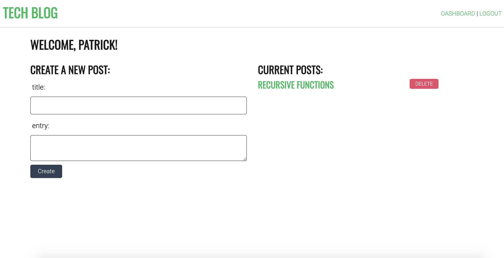
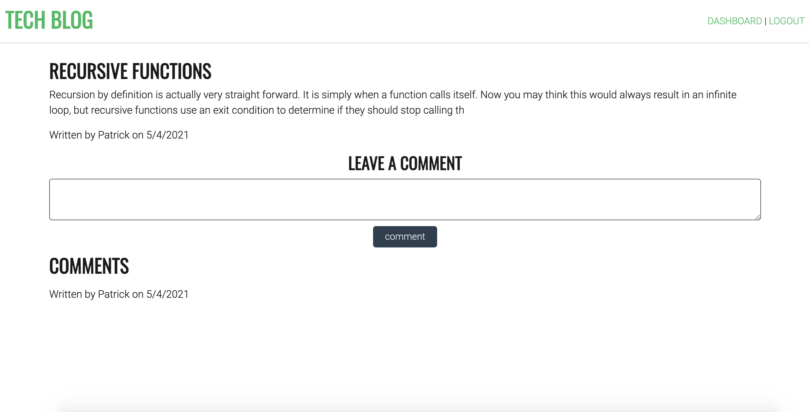

# Tech Blog
[](https://opensource.org/licenses/MIT)
## Table of contents
1. [Description](#description)
2. [Installation](#installation)
3. [Usage](#usage)
4. [Contributing](#contributing)
5. [License](#license)
6. [Screenshots](#screenshots)
7. [Technology Used](#technology)
8. [Questions](#questions)
8. [Links](#links)
    
<a name="descriptipn"></a>
## Description
This application is essentially a blog/open forum where any user can sign up and post a blog entry to the main page. 

### Code Snippet:
```
const newPost = async (event) => {
  event.preventDefault();

  const title = document.querySelector('#post-title').value.trim();
  const entry = document.querySelector('#post-entry').value.trim();

  if (title && entry) {
    const response = await fetch(`/api/posts`, {
      method: 'POST',
      body: JSON.stringify({ title, entry }),
      headers: {
        'Content-Type': 'application/json',
      },
    });

    if (response.ok) {
      document.location.replace('/dashboard');
    } else {
      alert('Failed to create post');
    }
  }
};
```
    
<a name="installation"></a>
## Installation
1. do an ```npm install``` to install all of your dependencies<br>
2. open the schema file in mysql workbench and execute it<br>
3. create a .env file and add values for username, password, and database
    
<a name="usage"></a>
## Usage
Navigate to the directory in terminal and type in ```node server.js``` to run the application. The application is also deployed at http://patricks-tech-blog.herokuapp.com/ if you would like to check out the functionality of the application. 
    
<a name="contributing"></a>
## Contributing
This application is open source so feel free to make it your own
    
<a name="license"></a>
## License
[](https://opensource.org/licenses/MIT)
<a name="screenshots"></a>
## Screenshots




<a name="technology"></a>
## Technology
### Technology Used
1. HTML
2. CSS
3. Javascript
    1. nodejs
    2. expressjs
    3. mysql
    4. sequelize
    5. handlebars
    6. bcrypt


<a name="questions"></a>
## Questions
Feel free to check out my [GitHub](www.github.com/pattymcpat) repository. Also feel free to send me an email at <patrickly72@gmail.com> if you have any questions

<a name="links"></a>
## Links
1. [GitHub Repository](www.github.com/pattymcpat/tech-blog)
2. [Deployed Application](http://patricks-tech-blog.herokuapp.com/)
3. [LinkedIn](https://www.linkedin.com/in/patrick-ly-aa280717a/)
4. [GitHub](www.github.com/pattymcpat)
